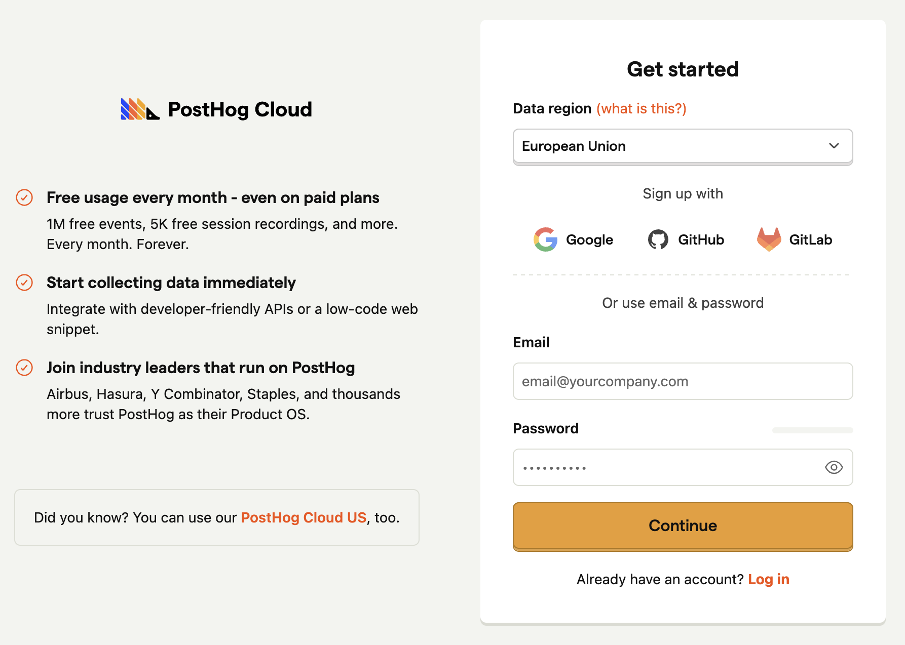
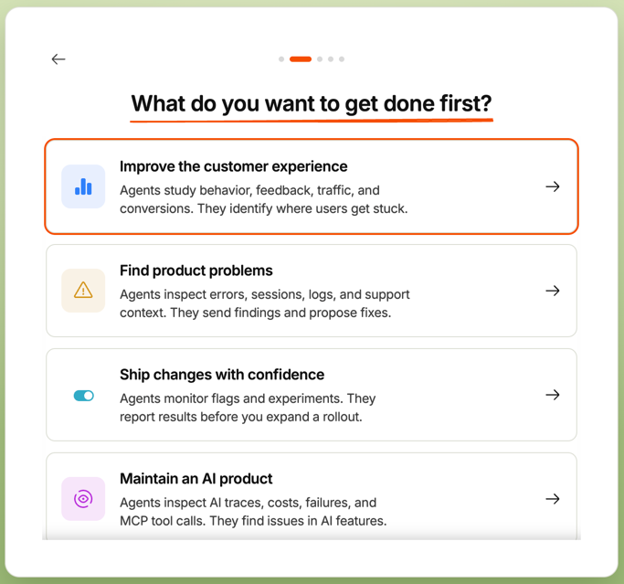
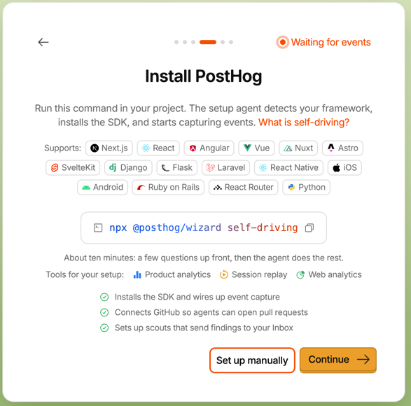
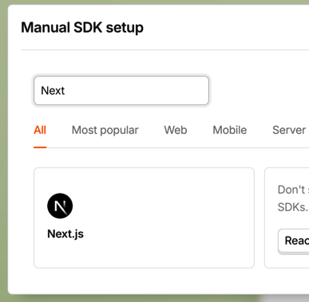
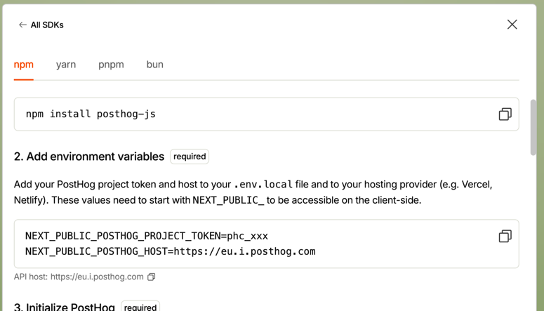
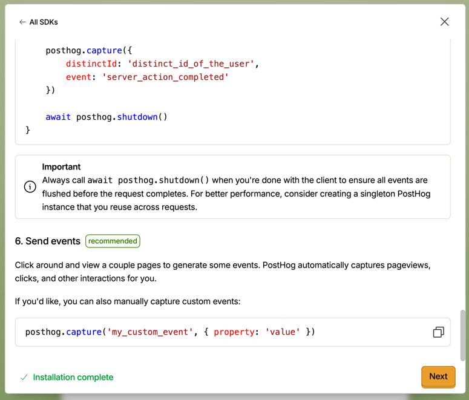
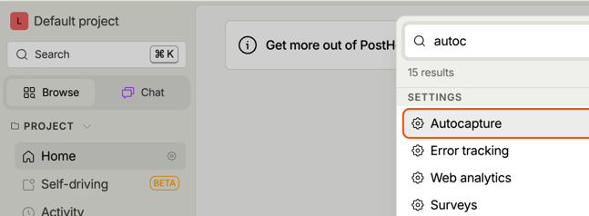
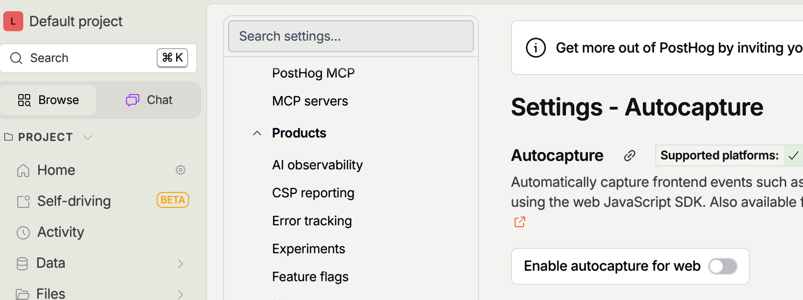
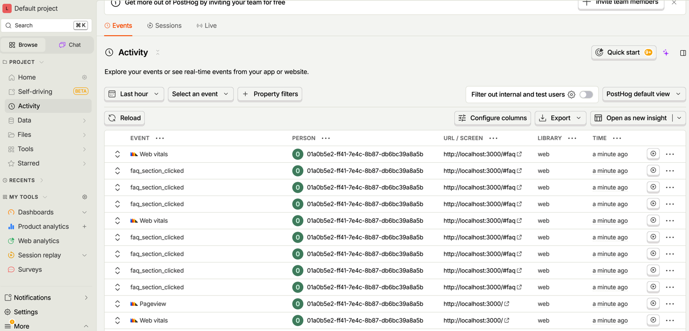
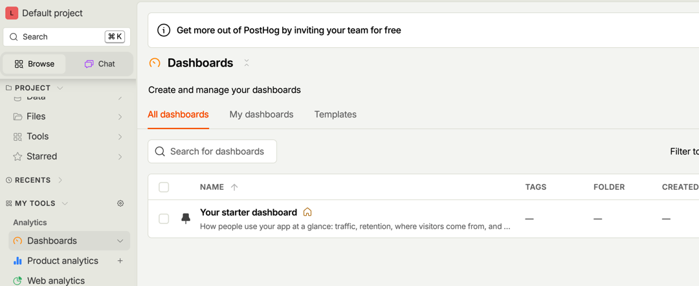

# Posthog-workshop

Velkommen til en workshop i PostHog! 

Etter workshopen vil du ha en bedre forståelse for funksjonaliteten PostHog tilbyr, og hvordan du kan bruke måleverktøy til å lage riktig ting.


# Oppgaver

Nedover følger oppgaver både i koden og innpå PostHog-prosjektet.

Ulike emojies betyr ulike ting:
- 👉 Oppgaven du skal gjøre, enten i kode eller i PostHog-prosjektet. På noen av oppgavene er det også fasit, som `oppgave1b.fasit.tsx`. Det gjelder ikke alle, ettersom det også er i PostHog-prosjektet.
- 💭 Refleksjonsspørsmål uten fasit. Oppfordrer å reflektere over dette, gjerne med et blikk i foreslått kilde.
- 📖 Litteratur-tips. Ofte en lenke til en nyttig bloggpost eller video. Kan hjelpe deg med oppgaven eller refleksjonsspørsmålet.
- 💡 Løsning i fasit. Poengtert ut hva løsningsforslaget i fasit er.

## Oppgave 1 - Lag ditt første event

I denne oppgaven lærer du hvordan du setter opp Posthog og lager ditt første event. Når du er ferdig, skal du kunne se dine egne eventer i Posthog-dashboardet.

<details>
  <summary>Oppgave 1a - Oppsett</summary>

Start med å klone repository.




Gå inn på https://eu.posthog.com/signup, opprett en bruker og en organisasjon, for eksempel "Hobby org".

Velg "Improve the customer experience".



På steget "Install PostHog", trykk "Set up manually" og velg Next.js. 

 

Ignorer nudgingen til å bruke AI setup wizard, og scroll ned til miljøvariablene - lag en fil med navn `.env.local` og dra disse inn.



Resten av instruksjonene i oppsettet har vi allerede gjort i `PostHogProvider.tsx`, se filen. Men du kan gjerne lese gjennom for å forstå hva som foregår.

For å fullføre oppsettet, kan du fyre opp prosjektet:

```
npm install && npm run dev
```

Så trykk deg rundt på siden. Om alt er rett, skal du se "Verify installation" markert i grønn nederst til venstre i PostHog, og du kan trykke "Next".



Skipp over "Add your website URLs", og velg gratis plan.

Nå har du konfigurert opp et prosjekt! Vi skal også skru av autocapture - vi kommer heller til å sende alle eventer manuelt. Søk på "autocapture" og huk bort "Enable autocapture for web".




 
🎉 Hurra! Du har kommet deg gjennom masse config! I neste oppgave skal vi gjøre noe så gøy som å tracke ditt første event!

💭 Refleksjon: Hvorfor bruke manuelle events istedenfor automatiske?

📖 https://posthog.com/tutorials/event-tracking-guide#autocaptures-limitations

</details>

<details>
  <summary>Oppgave 1b - Ditt første event</summary>

👉 Oppgave: Track hvilke FAQ- spørsmål som brukere åpner.
- I koden, legg til manuelt event på FAQ-spørsmål. Se `page.tsx`.
- I PostHog, sjekk fanen "Activity" for om eventet blir registrert. Du vil se noe som ligner på skjermbildet under. Åpne et event og se at du får med hvilken seksjon som ble klikket på, i et event property.




📖 https://posthog.com/docs/getting-started/send-events

💭 Refleksjon:
- Hvilke events bør du minimum tracke?

📖 https://posthog.com/tutorials/next-steps-after-installing#1-configure-event-capture

💭 Refleksjon:
- Hva må du gjøre annerledes om du vil tracke fra en serverkomponent versus klientkomponent?

📖 https://vercel.com/guides/posthog-nextjs-vercel-feature-flags-analytics#3.-using-posthog-with-react-server-components

<details>
  <summary>Løsning 1b</summary>

Se `oppgave1b.fasit.tsx`.

</details>

</details>

## Oppgave 2 - Visualiser innsikt

I denne oppgaven lærer du hvordan du kan visualisere innsikt i PostHog ved å bruke trender og funnels. Dette er viktig for å forstå brukerens atferd og finne forbedringsmuligheter i produktet ditt.

<details>
  <summary>Oppgave 2a - Trender</summary>

En trend-graf viser hvordan en event utvikler seg over tid.


👉 Oppgave: Lag en trend-graf med en annotasjon.
- Se fanen "Product analysis"

💭 Refleksjon:
- Hva er vits med å følge med på trender?
- Hvorfor bruke annotasjoner på trender?

📖 https://www.bekk.christmas/post/2024/07/forsta-produktet-ditt-med-posthog-lag-innsikt-ut-av-malingene

</details>

<details>
  <summary>Oppgave 2b - Funnels</summary>


👉 Oppgave: Finn ut hvor brukeren dropper av i skjemaet
- Skjemaet kan du navigere deg til via navbar og trykke på "Funnel"
- I koden, legg inn et event per spørsmål i skjemaet. Koden finner du i `/funnel/page.tsx`.
- I PostHog, kan du legge til Funnel også under "Product analysis". Legg inn action per steg

<details>
  <summary>Løsning 2b</summary>

Kode: Se `oppgave2b.fasit.tsx`.

Dashboard:


</details>

💭 Refleksjon:
- Om du ser dropp i prosenter per steg, hva er det tegn på - og hva kan du eventuelt gjøre med det?
- Hvordan kan du bruke funnels sammen med retention?

</details>

##  Oppgave 3 - Lag et dashboard

I denne oppgaven lærer du hvordan du kan samle innsikt i et dashboard i PostHog for å gjøre analyser mer oversiktlige og tilgjengelige.

<details>
  <summary>Oppgave 3 - Lag et dashboard</summary>



👉 Lag et nytt dashboard (ikke bruk default-dashboardet), og legg inn innsiktene du lagde i oppgave 2.

💭 Refleksjon:
- Hva er gode praksiser for å gjøre dashboardet oversiktlig?
- Om dette var et dashboard for ditt oppdrag, hva hadde du ønsket å ha med?

📖 https://www.bekk.christmas/post/2024/08/forsta-produktet-ditt-med-posthog-samle-innsikt-i-produkt-dashboard

</details>

## Oppgave 4 - Lag et eksperiment

I denne oppgaven lærer du hvordan du kan sette opp og gjennomføre et eksperiment i PostHog ved hjelp av feature flags og A/B-testing.

I FAQ-seksjonen er det et accordion der første punkt har en lenke til funnelen. En hypotese er at hvis accordion på dette punktet er åpent, så vil flere klikke seg videre til funnelen, enn om den er lukket.

<details>
  <summary>Oppgave 4a - Feature flag</summary>

👉 Gå inn på Experiments og opprett et nytt eksperiment. Generer samtidig et nytt feature flagg.

💭 Refleksjon:

- Hva har eksperimenter med feature flags å gjøre?
- Hvordan ville du ha lagt til et feature flagg som kun én person kunne se?

📖 https://posthog.com/docs/experiments/creating-an-experiment

📖 https://www.youtube.com/watch?v=ZgxabccQZzM

</details>

<details>
  <summary>Oppgave 4b - A/B-test</summary>

👉 Ta i bruk flagget i koden, så du kan kontrollere hvem som møter en åpen accordion og ikke.
- Endre koden i `page.tsx`.

💭 Refleksjon:

- Hvordan kan du være sikker på at en åpen accordion faktisk genererer flere besøk til /funnel?
- Tenk på hvilke oppgaver du holder på med i oppdrag. Er noen av disse aktuelle for eksperimenter?

📖 https://www.bekk.christmas/post/2024/09/forst%C3%A5-produktet-ditt-med-posthog-hypoteser

📖 https://www.youtube.com/watch?v=WyYPPSyKmXo

<details>
  <summary>Løsning 4b</summary>

Kode: Se `oppgave4b.fasit.tsx`.

</details>

</details>

## Session replay

I denne oppgaven lærer du hvordan du kan bruke Session Replay i PostHog for å se opptak av brukerøkter og analysere brukeradferd.

<details>
  <summary>Oppgave 5 - Session replay</summary>

👉 Oppgave: Spill av et opptak fra en tidligere sesjon

💭 Refleksjon:
- Hvordan vite hvilke sesjoner som er relevante for deg?
- Hvordan få se en sesjon når en feil oppstår?
- Hvordan kan du filtrere bort sensitiv informasjon fra opptak?

📖 https://posthog.com/tutorials/session-recordings-for-support

📖 https://posthog.com/docs/session-replay/privacy

</details>

## Tilbake til oppdrag

Nå har du fullført fem grunnleggende oppgaver for å forstå greia med måling i Posthog 🎉 Hvordan ta dette videre?

<details>
  <summary>Oppgave 6 - Tilbake til oppdrag</summary>

💭 For å ta dette videre, reflektér over følgende:
- Hvordan sørge for at du jevnlig jobber produktnært?
- Hvordan velge oppgavene som gir mest verdi for brukerne?

📖 https://www.bekk.christmas/post/2024/10/forsta-produktet-ditt-med-posthog-fra-innsikt-til-produktbeslutninger

</details>

# Ekstra oppgaver

Om du har lyst til å dykke videre i PostHog, her er noen forslag til oppgaver.

## Identifisér brukeren

Legg til et skjema hvor brukeren kan skrive inn epost, og følg deretter brukeren for å identifisere hen. Se https://posthog.com/tutorials/identifying-users-guide og video https://youtu.be/LIJ_TuyMq74?si=fukxQhy67JZSjYPf&t=290

## Track uten behov for cookie-banner

Om du ikke vil lagre brukerens info i cookies, kan du flytte lagringen. Prøv det ut: https://posthog.com/tutorials/cookieless-tracking

## Test med posthog

Lag en test med Jest og Posthog: https://posthog.com/tutorials/test-frontend-feature-flags

# Innspill

Takk for at du deltok i workshopen!

Om du finner feil i oppgave eller tekst, eller bare har forbedringer, bare å ta kontakt med meg eller lag en PR.
